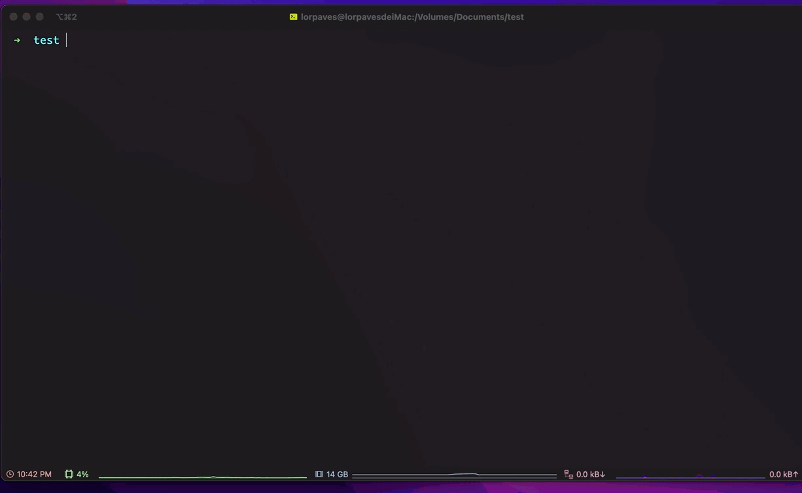
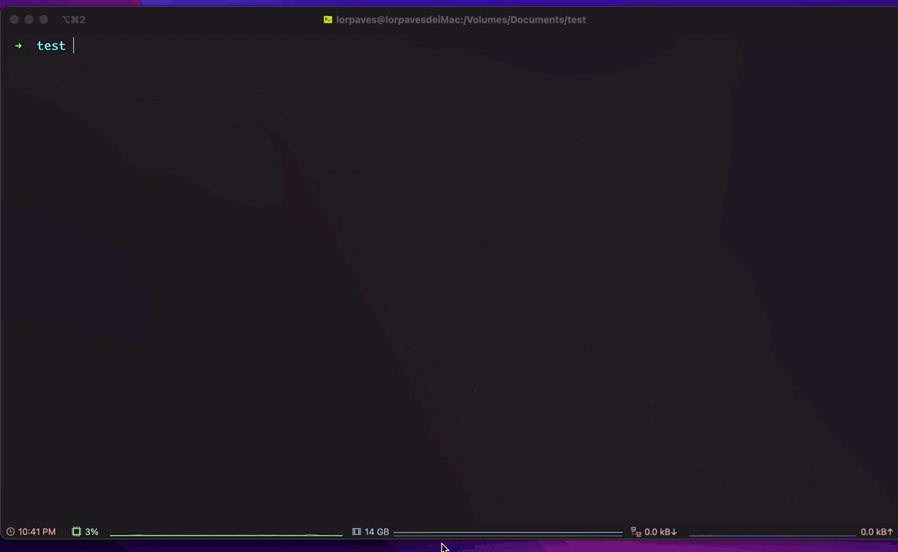

# 字幕翻译工具

Get the tool(Downloads)[https://github.com/Lorpaves/sub_translator/releases/tag/v1.1.0]

### 命令行工具使用说明

```shell
# 翻译当前目录下所有的字幕文件
# translate all subtitle files at the current directory
./sub-ts -D .

# 翻译 file1 file2字幕 和当前目录下的所有字幕文件
./sub-ts -i file1 file2 -D .

# 翻译 file1 file2字幕 和c:\\dir1目录下的所有字幕文件 服务器为bing，使用CNip
./sub-ts -i file1 file2 -D c:\\dir1 --server bing --use-cn
```

### 命令行参数说明

```shell
# 默认选项
# NOTE: -i 和 -D选项 至少要一个
options:
  -h, --help            show this help message and exit

  # 要翻译的文件，可以是多个 file1 file2
  -i INPUT FILE [INPUT FILE ...], --input INPUT FILE [INPUT FILE ...]
                         original file, ex: file1 file2

   # 多个文件的翻译，可以指定目录，将翻译目录下的所有字幕文件，文件会储存在指定的目录下，后缀为-zh
  -D INPUT DIRECTORY [INPUT DIRECTORY ...], --directory INPUT DIRECTORY [INPUT DIRECTORY ...]


# 自定义选项
advanced options :
   advanced options of the translation

  # 翻译服务，默认为random，最好不要选择特定的翻译服务器，否则翻译请求会被阻止。
  # random就是在规定次数内切换翻译服务器，防止被阻止请求而中断翻译。
  -S SERVER, --server SERVER
                         the server that send request to translate the text. Defaults to "alibaba"

  # 翻译多少次后切换翻译服务器，默认为20次，只有在翻译服务器为random的时候才生效。
  -s SWITCH DURATION, --switch-duration SWITCH DURATION
                         the translation times before switching translation server. Defaults to 20
  # 默认为英文:en，可选，支持的语言参考：https://pypi.org/project/translators/
  -f FROM LANGUAGE, --from-language FROM LANGUAGE
                         original language. Defaults to "en".

  # 默认为中文:zh，可选，支持的语言参考：https://pypi.org/project/translators/
  -t TO LANGUAGE, --to-language TO LANGUAGE
                         target language to translate. Defaults to "zh"

  # 设置代理服务器，默认无代理，如要设置，则在命令行末尾加入 [-p 127.0.0.1:8888]
  -p PROXY, --proxy PROXY
                         set proxy server of the requests

  # 使用CN服务器，如果在国内，需要在选项中加入这个，不使用代理的话，无法访问谷歌翻译服务，则将翻译服务切换为其它
  -uc, --use-cn
                         choose to use local CN host. Defaults to not use

  # 选择此项将无视空的翻译文本
  -e, --ignore-empty     ignore the empty translate text. Defaults to not ignore

  # 单词翻译的文本长度限制在5000内， 选择此项将无视长度超过5000以后的文字
  -l, --ignore-length    ignore the limited length of the text in one time of translation. Defaults to not
                        ignore

  # 每次翻译后休息的时间，如果有SSL请求错误，建议设置单词请求后的休息时间，默认为不设置休息时间
  -d, --set-duration     set translate duration. Defaults to not set the duration

  # 如果设置了单次翻译休息的时间，可以选择休息时间长久，默认为1秒
  -dt DURATION, --duration-time DURATION
                         set the translate time. Defaults to set the duration 1 second

```

### 说明

支持的字幕格式: SubRip (SRT), MicroDVD(microdvd), WebVTT formats(vtt),Advanced SubStation Alpha v4.0+(ass),SubStation Alpha v4.0(ssa)

Support extension: SubRip (SRT), MicroDVD(microdvd), WebVTT formats(vtt),Advanced SubStation Alpha v4.0+(ass),SubStation Alpha v4.0(ssa)

字幕会以 SubRip 的格式储存
The translated file will be saved as SRT formats

支持的翻译服务：Google, Alibaba, Yandex, Microsoft(Bing), Kingsoft(Iciba), Sogou, Lingvanex, Itranslate, Caiyun, Argos, Baidu, Tencent

Available Server: Google, Alibaba, Yandex, Microsoft(Bing), Kingsoft(Iciba), Sogou, Lingvanex, Itranslate, Caiyun, Argos, Baidu, Tencent

### 命令行工具使用实例






### Python 使用示例

#### 安装

```shell
git clone https://github.com/Lorpaves/sub_translator.git

cd sub_translator

pip install -r requirements.txt

```

```python
import pysubs2 as pysub
import translators.server as tss
import SubTranslator

sub_ts = SubTranslator.SubTranslator(pysub=pysub, tss=tss)
sub_ts.translate_sub(path='./test.srt', file_name = './save.srt',
                     from_language='en', to_language='zh')

```

#### Python 引用参数说明

```python
SubTranslator
if_duration (bool: Default False) # if need to set translate duration, set this to True
duration (int) # duration
if_ignore_empty_query (bool: Default True) # if the text was empty, set True to ignore the text, else will throw error
if_ignore_limit_of_length (bool: Default True)  # Default limited length is 1500, set to True to ignore the error
if_use_cn_host (bool: Default True)  # use cn host or not
server (str: Default "alibaba") # the server that send request to in order to translate the text

SubTranslator.translate_sub
path (string): #path of the subtitle file
file_name (str): # the name used to save the translated subtitle file
from_language (str): # original language
to_language (str): # target language to translate
```

### 特别感谢

- pysubs2: https://pypi.org/project/pysubs2/

  pysubs2 is a Python library for editing subtitle files.
  It's based on SubStation Alpha,the native format of Aegisub

- translator: https://pypi.org/project/translators/

  Translators is a library which aims to bring free, multiple, enjoyable translation to individuals
  and students in Python. It based on the translation interface of Google, Yandex, Microsoft(Bing),
  Baidu, Alibaba, Tencent, NetEase(Youdao), Sogou, Kingsoft(Iciba), Iflytek, Niutrans, Lingvanex,
  Naver(Papago), Deepl, Reverso, Itranslate, Caiyun, TranslateCom, Mglip, Utibet, Argos, etc.
